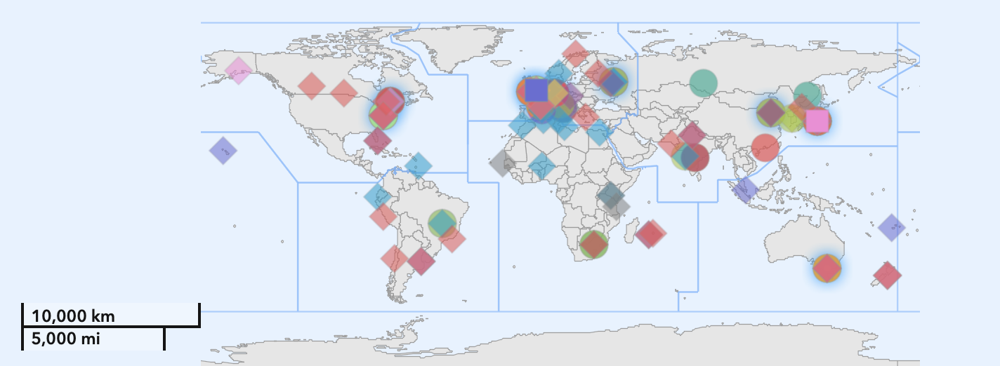

# Data Formats for Climate And Weather Forecast

This directory contains some notes on common data formats used in the Climate
and Forecast Community.

 * [Presentation](https://github.com/Sera91/Tutorials-SMR4067/tree/main/Day2/IO/Graziano/SMR4067-Giuliani.pdf)

## The Big Problem and some words

What is pushing humankind to predict the weather and climate state are
Science, Strategic advantage, Public Service, Profit and Fear.

What we scientists want to do is understand why natural phenomena
do occur. To do that with the scientific method, we search for the minimum
set of problem relevant quantities we can measure to describe the system,
and we concoct the set of mathematical equations that use those variables
able to describe the time evolution of the system in non equilibrium state.

Looking at atmosphere and ocean as physical systems, we cannot find a "good"
mathematical solution. The complex nature of the problem, and the tools
we have from Physics, point to the fact that we can only get an approximate
description of the system state, while the physical equation describing the
time evolution would instead require a "perfect" knowledge.
The best variables we can measure only describe the state of the system
in a statistical sense: what we have are badly defined variables which we
cannot possibly take a measure of regularly in time and space. The techniques
we can use to solve the equations which describe the system require fixing
a resolution for the description of the state, but whichever the resolution
we select to attempt a numerical solution strategy force a part of the problem
to be treated with the wrong set of variables and equations.
Ah, and yes, we cannot mathematically even asses if a solution do exist and
is smooth in the first place for the analytical not overly simplified three
dimensional physical equations; and the dimension of the attractor in the
phase space of the is so large that Kac's lemma fails miserably to grant the
practical use of the Takens theorem.

Given the nature of the equations, to obtain a numerical prediction we must
consider at least two limitations:

  * The system is deterministic but chaotic, and the typical Lyapunov
    exponent for which we can perform a prediction of the system state
    with a reasonable tolerance, for example we want to know if the
    temperature will be one degree greater or lower than today, is of the
    order of $\approx \left( {1} \over {10 days} \right)$.
  * For any reasonable intent, we can attempt a numerical solution (with
    all its limits) only by accepting the use of the wrong set of variables
    and equations for the part of the problem we cannot describe at the
    spatial resolution used by the solver.

Because of the Strategic Advantage the knowledge of the weather poses to
a warring party, the exorbitant cost of the computation at some point of the
human history got enticing to be paid.
And the results were so successful that, when the cost of the process went
down thanks to the technology advance in computers, and the world political
landscape switched out of fighting mode into an era, if not of peace, at least
of collaborative disagreement, getting to know what will be the weather
the day after tomorrow shifted from arcane magic to possible and into a
Public Service that any reasonably developed nation should provide to its
citizens.
Some smart fellas on top of the publicly available data that The Service
needs to function soon built their own living, providing for Profit added value
products able to answer questions on the impact of weather patterns on the
myriad of human activities. After a lot of number cranking and data
collection, we do now understand some statistical properties of the set of
variables we use to describe the system state, and we can provide
future scenario of change happening in response to shifting human activities,
pushing far beyond the equation based system physical predictability.

## Historical Notes

The weather prediction effort has been historically one of the first
scientific studies heavily relying on data sharing using digital formats.
The problem is inherently dependent on the knowledge of the system initial
state: if we can describe the current state of the atmosphere and underlying
surface and energy input into the system and if we know the physical laws
which govern their behavior, we can, in principle, predict future weather.
To predict the weather on small time scales, we can make with local measures.
The longer into the future we want to predict, the farther away we need
measurements to be reaching us before a prediction can be attempted. On time
scales of days, we already need global information coming from measurement
sites scattered all over the world. And no contry can be independent from
other: the data collection MUST be a global endeavor, and thus requires
a global framework. The establishment of an International Meteorological
Organization [IMO] dates back to 1873, spurned from the seeds planted by the
visionary German naturalist Alexander von Humbold's radical conception of
Nature as an interconnected global force the humankind must reckon with and
of which we are just part and not the masters.

The need to expand the international data exchange for both research and
practical application led after Second World War to the replacement of the
non-governmental IMO by the intergovernmental World Meteorological Organization
[WMO] in the framework of United Nations collaborative efforts.
Data exchange was identified as a central purpose of WMO in its 1947
Convention. The new WMO framework was reinforced over its first two decades
through the special data collection systems that were put in place for the
1957 International Geophysical Year and then, more ambitiously, through the
1967 launch of the World Weather Watch and the Global Atmospheric Research
Programme (GARP). This program has finally produced a global data collection
and exchange system which has permitted to National and International
Meteorological Services the ability to provide public routine operational
Numerical Weather Prediction [NWP] services taking advantage of the
results of the pioneering work of the von Neumann Meteorological Project and
the birth of the joint US Air Force and Navy Weather Bureau under Charney.

In the unanimously adopted WMO 1995 Congress Resolution 40, the free exchange
of essential data products is established as a "fundamental principle" of WMO.

Over multiple following congresses of the WMO the free nature of data as been
extended to hydrology and oceanographic data towards the establishment of
more robust and unified policy framework for international exchange of all
Earth System data [WMO, 2019].

WMO lists today 15 Centres for Global Deterministic NWP, 9 of them providing
also ensemble numerical weather prediction, as part of its Integratedi
Processing and Prediction System (WIPPS). The WIPPS coordinates the
preparation of meteorological analysis and forecast fields and makes them
available worldwide.

In recent decades, the WIPPS centers have considerably expanded the number
and quality of products made available, enabling all who provide observational
data to benefit from the analyses and forecasts that their observations support.
The limited-area NWP systems operated by many countries and regional agencies
also benefit from global data exchange. Although these systems only require
observational data over the domains they cover, boundary condition data
are needed for the duration of the forecast, and they come from Global NWP.

In Europe the major RSM center part of the WIPPS providing NWP data is the
European Centre for Medium Range Weather Forecast [ECMWF], and provides along
with the deterministic forecast also ensemble and now AI based NWP products.

The WMO also provide standards for the design of observing networks, as defined
in its Rolling Review of Requirements (RRR) for observations.  Historically,
separate observing networks were developed to serve different communities and
applications, using different standards, formats and communications mechanisms, 
even though many of the geophysical variables being measured were the same.
In principle, it was possible to use the observations made by one community to
serve another, but in practice this was often difficult, time-consuming and
expensive. In order to eliminate the perceived redundancy between such networks 
and facilitate a joint use of the assets, WMO developed the concept for a WMO
Integrated Global Observing System (WIGOS), which was launched in 2011 and
declared operational in 2019.

 * [WMO Background, History and Impact](https://wmo.int/media/magazine-article/wmo-data-exchange-background-history-and-impact).
 * [WMO Resolution 40](https://community.wmo.int/en/resolution-40).
 * [WMO WIPPS portal](https://wmo.maps.arcgis.com/apps/dashboards/7c3d45e5003a417988bad63e91ad8748)

## WMO Official formats

In its effort to foster data exchange, the WMO has over the years developed
a number of Official Exchange Data Formats, for measurements and model data.

 *  BUFR data format
     * [BUFR 3 and CREX](https://community.wmo.int/en/activity-areas/wmo-codes/manual-codes/bufr-edition-3-and-crex-edition-1)
 *  GRIB data format
     * [GRIB1](https://community.wmo.int/en/activity-areas/wis/grib-edition-1)
     * [GRIB2](https://old.wmo.int/extranet/pages/prog/www/WMOCodes/Guides/GRIB/GRIB2_062006.pdf)

Focus of this format is on the TRANSMISSION of the data. They have been
very craftly engineered in an era in which the network connection were at
best unreliable, and the major points are:

 * Data compression : data coding in bit pattern to obtain compression based
   on the data PHYSICAL information content. Version 2 supports also
   image compression algorithms on top of the bit shaving. Any metadata are
   not with the data, but are shared between the sender and receiver as
   documents. The data contains only the smallest possible bit pattern to
   link to the documentation. Only the data described in the pre-shared
   tables can be transmitted and sender and receiver must agree in advance
   on the reference tables used in the transmission.

 * Partial data transmission : data are split in the smallest unit possibles
   and any transmission error would just prevent the full reception, but if
   part of the data are not received the information content of the received
   part is still fully usable and complete.

Obviously, this is not anymore what a user would focus on in the world of
today fast and reliable (TCP/IP based) interconnected internet.
Thus, WMO official formats, even though are still the default in WMO centers
communication, suffer of multiple drawbacks, the major of which is the
necessity of sender and receiver to share the data table used in the
transmission. Not to mention that the table MAY and HAVE changed in time.

For the real time data transmission of measurements, WMO has recently migrated
to the new WMO Information System 2.0 which in time will superseed the old GTS
network.

 * [WIS 2.0](https://community.wmo.int/en/activity-areas/wis/WIS2-overview)
 * [WMO Machine Readable Codes](https://community.wmo.int/en/wis/latest-version)

You can find in this directory data in GRIB2 format, retrieved from:

 * [ECMWF forecast](https://data.ecmwf.int/forecasts/)

### How to access data

ECMWF provide a library to read all the ECMWF produced data: ECCODES

 * [ECCODES](https://confluence.ecmwf.int/display/ECC)

This library has multiple languages interfaces, one of which is python, and
multiple command line tools. Better, there is cfgrib, a Python interface to
map GRIB files to the NetCDF Common Data Model following the CF Convention
using ecCodes, transparent to xarray integration:
Only a field has been selected using eccodes grib\_copy program.

>>>
    import xarray as xr
    ds = xr.open_dataset('tp_20250502000000-3h-oper-fc.grib2', engine='cfgrib')
>>>

 * [xarray](https://docs.xarray.dev/en/stable/)
 * [cfgrib](https://github.com/ecmwf/cfgrib)

## NetCDF format

NetCDF (Network Common Data Format) is a set of software libraries and
self-describing, machine-independent data formats that support the creation,
access, and sharing of array-oriented scientific data. Initially developed by
the Unidata program at the University Corporation for Atmospheric Research
(UCAR), it is now supported by a larger community.
The format is an open standard. NetCDF Classic and 64-bit Offset Format are
an international standard of the Open Geospatial Consortium.

Multiple communities use and rely on the format. Historically the format focus
is in on the interoperabiity of data stored in this format. A big commitment is
on backward compatibility (any new version of the library must be able to
read ANY old netCDF file), and on the possibility to use it to describe
multidimensional data with any reasonable attribute.

The data in a netCDF file is stored in the form of multidimensional arrays.
The data stored in an array needs to be of the same type (homogeneous).
A netCDF file contains dimensions, variables, and attributes. These components
are used together to capture the meaning of data and relations among data
fields in an array-oriented dataset.
Dimensions are used to represent the shape of variables. A dimension may be
used to represent a real physical dimension, for example, time, latitude,
longitude, or height; or more abstract quantities like station or model-run ID.
Dimensions can be unlimited: how many dimensions can be unlimited depends on
which on-disk format is chosen. Data can be appended to any of the nlimited
dimensions. Attributes can be added to the file or any of the variables. No
vocabulary is defined in the netCDF format, except for the attribute that
can be set by the library to specify filling value per variable. 

A Python native library can be used to read data, and the xarray library has
a transparent interface to a dataset in NetCDF format.

Multiple tools exists to transform netCDF data to/from WMO format.

What is missing to netCDF is what instead for the GRIB is mandatory, i.e.
a standard to describe data: the netCDF is a generic format, to store ANY kind
of data, while data clients and consumer ned catalogues and standards to code
for.

 * [netcdf](https://www.unidata.ucar.edu/software/netcdf/)
 * [netcdf4 python](https://unidata.github.io/netcdf4-python/)
 * [xarray netcdf python](https://docs.xarray.dev/en/stable/user-guide/io.html)

## CF convention

The CF metadata conventions are designed to promote the processing and
sharing of files created with the NetCDF API. The conventions define metadata
that provide a definitive description of what the data in each variable
represents, and the spatial and temporal properties of the data.
This enables users of data from different sources to decide which quantities
are comparable, and facilitates building applications with powerful extraction,
regridding, and display capabilities. The CF convention includes a standard
name table, which defines strings that identify physical quantities.

 * [CF metadata](https://cfconventions.org/Data/cf-conventions/cf-conventions-1.12/cf-conventions.html)

The CF conventions for climate and forecast metadata is designed to promote
the processing and sharing of files created with the netCDF Application
Programmer Interface. The conventions define metadata that provide a
definitive description of what the data in each variable represents, and of
the spatial and temporal properties of the data. This enables users of data
from different sources to decide which quantities are comparable, and
facilitates building applications with powerful extraction, regridding, and
display capabilities.

 * [CF variable vocabulary](https://cfconventions.org/Data/cf-standard-names/current/build/cf-standard-name-table.html)
 * [CF area vocabulary](https://cfconventions.org/Data/area-type-table/current/build/area-type-table.html)
 * [CF region vocabulary](https://cfconventions.org/Data/standardized-region-list/standardized-region-list.current.html)

## CMIP experiment format

CMIP is the acronym of the project of the World Climate Research Programme
(WCRP) providing climate projections to understand past, present and future
climate changes. CMIP and its associated data infrastructure have become
essential to the Intergovernmental Panel on Climate Change (IPCC) and other
international and national climate assessments. Regional models part of the
Coordinated Downscaling xperiment (CORDEX) provide physical downscaling of
global models at regional scale in the framework of the WCRP effort.

Data can be retrieved by the ESGF server federation infrastructure:

 * [ESGF DKRZ Metagrid Node](https://esgf-metagrid.cloud.dkrz.de/search)
 * [WCRP CMIP](https://wcrp-cmip.org/)
 * [CMIP experiment documents](https://wcrp-cmip.org/cmip-model-and-experiment-documentation/)

An example can be had in the data directory, a timestep from this file:

[tas\_Amon\_CMCC-ESM2\_ssp370\_r1i1p1f1\_gn\_201501-210012.nc](https://esgf-data1.llnl.gov/thredds/fileServer/css03_data/CMIP6/ScenarioMIP/CMCC/CMCC-ESM2/ssp370/r1i1p1f1/Amon/tas/gn/v20210202/tas_Amon_CMCC-ESM2_ssp370_r1i1p1f1_gn_201501-210012.nc)

The need to produce data in a FAIR format (Findable, Accessible,
Interoperable, and Reusable) requires software library helping in produce
the correct set of attributes for the data files. Because models may use their
own data format, a "model output rewriter" has been developed in the framework
of the CMIP project, getting to become an acronym to the process of rewriting
the data in the CMIP format: the data cmorization.

 * [Climate Model Output Rewriter](https://cmor.llnl.gov/)

Each group responsible for a model must write the reader part of a format
change program, the output part can be coded using CMOR.

More recent effort has been put in adding output layers to models able to
direclty write in parallel the data in the netCDF format:

 * [XIOS](https://forge.ipsl.jussieu.fr/ioserver)

## Measurement datasets

A lot of global, regional, national compiled, gridded, certified, verified,
dataset can be retrieved from multiple sources. At this point it has become
somewhat problematic in some cases to asses the level of independence of the
information present in the different datasets, especially for the gridded data
which are compiled using multiple different data sources.

WMO does even provide a Stewardship Maturity Matrix for Climate Data to help
a user asses the quality of the data, classified on multiple levels for
different classes of data accessibility and content. In short, the higher the
quality (managed, well defined, fully implemented, controlled, audited, etc)
the "greener" the colour of the data.

 * [wmo data](https://climatedata-catalogue-wmo.org/global-datasets-selector)

Multiple global or regional catalogues of data are accessible:

 * [EU Copernicus](https://climatedata-catalogue-wmo.org/global-datasets-selector)
 * [NCAR NSF RDA](https://rda.ucar.edu/)
 * [NOAA data](https://www.ncdc.noaa.gov/cdo-web/datasets)
 * [ESA climate](https://climate.esa.int/en/data/#/dashboard)

Example of regional catalogues:

 * [DWD CDC](https://www.dwd.de/EN/climate_environment/cdc/cdc_node_en.html)
 * [UK](https://climate-themetoffice.hub.arcgis.com)
 * [France](https://meteonet.umr-cnrm.fr)
 * [Canada](https://climate.weather.gc.ca)
 * [Regione FVG](https://www.dati.friuliveneziagiulia.it/browse)

Apart from the measurements going into the WIS (the former GTS), a number of
national, regional, common citizen measurement network exist, but it is very
difficult to asses the quality of the measurement instrument, of the mesurement
process, of the data handling and transmission. SOME standard are possibly
present for measure from high end instruments of renowed manufacturer, but the
physical placement of the measuring station, the maintenance status, the timing
uncertainty of the measurements prevents merging most of the measurements into
a consistent and synoptic picture of the state of the earth system.
Moreover, due to the noise present into surface measures, the assimilation
process into NWP models needs vertical profiles, either from the ground or
from space through satellite platforms.
For the past, station density gets very low and sparce before 1950, and only
indirect measurements are possible for the far past, and gridded reconstruction
of physical quantities are coarse and possibly well defined only in some areas
of the world, generally on land.
In terms of measurements, the past timeseries we can reconstruct and can be
used as reference, is mostly at the surface, limited to some variables,
sparse and under/over representing some areas, limited in time and subject
to frequent revisions to account for measurement process uncertainties.

## A common swiss army knife for climate data analysis

Climate Data Operators (CDO) is a single monolithic program but also a lot of
powerful tools that simplify, accelerate, and standardize the manipulation,
analysis, and transformation of climate data.
It can be programmed in complex pipelines especially useful for working with
large datasets exploiting platform avalable parallelism to perform routine
climate analysis by reproducible workflows.

The main CDO features are:

    * Unix pipeline like design that make possible to create new operators
    * Very simple UNIX command line interface
    * Support for many different grids and formats
    * CF compliant handling
    * Fast processing of large datasets

### How to setup cdo on the leonardo cluster

On leonardo, ICTP maintains a set of data analysis programs which can be set
into the user path by:

>>>
    source /leonardo/home/userexternal/ggiulian/modules_gfortran
>>>

After this, the user can try running cdo:

>>>
    cdo -h
>>>

Let's see the list of operators:

>>>
    cdo --operators
>>>

It is a list too long to put here! WOW! To get information on a particular
operator, we can use:

>>>
    cdo -h [operator]
>>

as in:

>>>
    cdo -h yseasmean
>>>

This will print a "man like" formatted printout!
The full manual can be had here:

 * [CDO manual](https://code.mpimet.mpg.de/projects/cdo/embedded/index.html)

It is really impossible to look into the full rrange of things you can do with
cdo! We will look into a possible use in a real case scenario.

### Use case scenario.

* A user (me) needed to create the initial condition for a regional model
  simulation over the Mediterranean basin on a tripolar NEMO grid starting
  from the ECMWF Ocean Model reanalysys, ORAS5.
  This requires:
    * Interpolating on the target grid
    * Filling in missing data
    * Interpolating on target vertical level
    * Masking out missing data
    * Selecting for the years 1970-1975 the month of August
    * Averaging all the data over time
 
Initial data:

>>>
    mkdir data
    cd data
    ln -sf /leonardo_work/ICT25_ESP/MITGCM/MED12-ocean-mit/ORAS5/votemper/* .
>>>

Ww can have a look at one of the data using cdo itself:

>>>
    cdo sinfo votemper_control_monthly_highres_3D_202408_OPER_v0.1.nc
>>>

We have horizontal and vertical information about the target grid in two files:

>>>
    ln -sf /leonardo_work/ICT25_ESP/MITGCM/MED12-ocean-mit/ORAS5/mask.nc .
    ln -sf /leonardo_work/ICT25_ESP/MITGCM/MED12-ocean-mit/ORAS5/depth.nc .
>>>

We can use again cdo:

>>>
    cdo sinfo mask.nc
    cdo sinfo depth.nc
>>>

Let's start for a single file for a single step.

#### Interpolation on target grid

Extract the target grid information from mask.nc file:

>>>
    cdo griddes mask.nc > grid.des
>>>

cdo has a number of interpolation operators, but we want to use the simplest.

>>>
    cdo -h remapnn
>>>

Let us see the typical single command use of cdo:

>>>
    cdo [option] [operator] [infile] [outfile]
>>>

In this case:

>>>
    cdo remapnn,grid.des votemper_control_monthly_highres_3D_202408_OPER_v0.1.nc tmp.nc
>>>

Let's see what is in the tmp.nc:

>>>
    cdo sinfo tmp.nc
>>>

Great! The grid is now only the med! We can use the ncview program to have
a brief look:

>>>
    ncview tmp.nc
>>>

#### Interpolation on target vertical levels

We can use another cdo command to extract infomation about vertical levels:

>>>
    cdo -s showlevel depth.nc
>>>

we can put commas in between with UNIX command tr:

>>>
    cdo -s showlevel depth.nc | tr " " ","
>>>

and save this result in a shell variable:

>>>
    levels=$(cdo -s showlevel depth.nc | tr " " ",")
>>>

Let's vertical interpolate on those levels!

>>>
    cdo intlevel${levels} tmp.nc tmp1.nc
>>>

#### We can now have a look at filling in missing values.

>>>
    cdo setmisstonn tmp.nc tmp2.nc
>>>

or vertically:

>>>
    cdo vertfillmiss tmp.nc tmp3.nc
>>>

#### And now, superpowers!

Let's put this all togheter! Use the power of pipelining in cdo!

>>>
    cdo intlevel${levels} -setmisstonn -vertfillmiss -remapnn,grid.des \
      votemper_control_monthly_highres_3D_202408_OPER_v0.1.nc tmp.nc
>>>

#### What is missing? Ah, the mask!

>>>
    cdo mul mask.nc -intlevel${levels} -setmisstonn -vertfillmiss \
      -remapnn,grid.des \
      votemper_control_monthly_highres_3D_202408_OPER_v0.1.nc tmp.nc
>>>

What is nnow the input file? It is not a netcdf! We must force it. And compress
it.

>>>
    cdo -f nc4 -z zip_4 mul mask.nc -intlevel${levels} -setmisstonn \
      -vertfillmiss -remapnn,grid.des \
      votemper_control_monthly_highres_3D_202408_OPER_v0.1.nc tmp.nc
>>>

### Last bits: the merging and the time averaging

>>>
    cdo griddes mask.nc > grid.des
    levels=$(cdo -s showlevel depth.nc | tr " " ",")
    for file in votemper_control_monthly_highres_3D_197[0-5]08_*_v0.1.nc
    do
        cdo -f nc4 -z zip_4 mul mask.nc \
           -intlevel${levels} -setmisstonn -vertfillmiss \
           -remapnn,grid.des $file $(basename $file .nc)_remap.nc
    done
    cdo mergetime *remap.nc tmp.nc
    cdo ymonmean tmp.nc final.nc
>>>

We have it!

>>>
    ncview final.nc
>>>

#### And python!

There is also a python package!

>>>
    ipython3
    Python 3.13.2 (main, Mar 17 2025, 09:56:08) [GCC 12.2.0]
    Type 'copyright', 'credits' or 'license' for more information
    IPython 9.2.0 -- An enhanced Interactive Python. Type '?' for help.
    Tip: You can use LaTeX or Unicode completion, `\alpha<tab>` will insert the α symbol.
    In [1]: from cdo import *
    In [2]: cdo = cdo.Cdo( )
    In [3]: 
>>>

 * [CDO python](https://code.mpimet.mpg.de/projects/cdo/wiki/Cdo%7Brbpy%7D)
